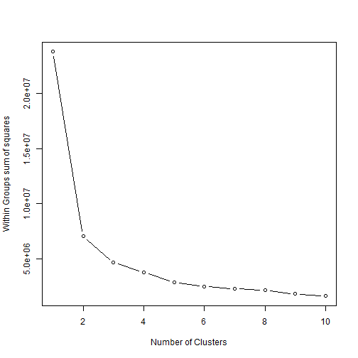
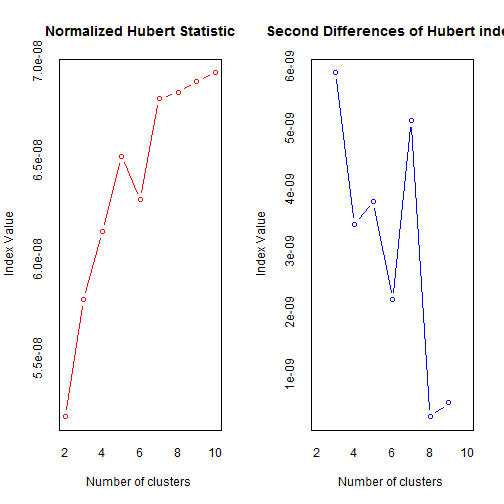
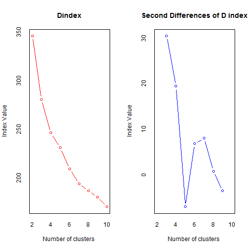
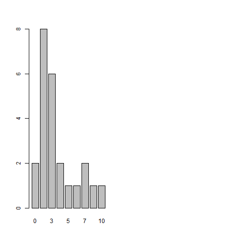

```r
# Read the csv file
cData = read.csv("USCrime2012.csv")
dim(cData)
```

[1] 50 10

```r
names(cData)
```

 [1] "State"                          "ViolentCrime"                  
 [3] "MurderNonNegligentManslaughter" "ForcibleRape"                  
 [5] "Robbery"                        "AggravatedAssault"             
 [7] "PropertyCrime"                  "Burglary"                      
 [9] "LarcenyTheft"                   "MotorVehicleTheft"             


Crime rates (per 100,000 people) for 9 different types of crimes are present for each of the 50 US States. 

#### Distribution of each crime type across States

In this chart, you can select a particular crime and the corresponding numbers for different States. You should be able to hover over the bars to get the exact numbers.


```r
library(rCharts)  # nvd3 plot through rCharts
crimebarPlots = nPlot(ViolentCrime ~ State, data = cData, type = "discreteBarChart")
crimebarPlots$xAxis(rotateLabels = -90)
crimebarPlots$addControls("y", value = "ViolentCrime", values = names(cData[, 
    -1]))
# crimebarPlots$save('crimebarPlots.html',cdn=T)
# crimebarPlots$publish('crimebarplot',host='gist')
```

<iframe height="675" src="http://www.pagist.info/7968124" width="1300"></iframe>

#### Which States had higher rates of different types of crimes? 

The heatmap below provides a clue to answering this question. Along the columns are different crimes (you don't see all labels but if you hover over the rectangle tiles, you should see the crime identified) and along the rows are different States. Values for individual crimes are scaled to a 0 to 1 scale, thereby permitting a visualization of all variables in a better manner. Higher the value for a crime, higher the intensity of red and the scaled value will be closer to 1. Lower the value for a crime, lower the intensity of the red--- or white if crime rate is zero.


```r
library(plyr)
library(scales)
library(reshape2)
statemelt = ddply(melt(cData), .(variable), transform, rescale = rescale(value))
names(statemelt) = c("State", "Crime", "value", "rescale")
hmap <- rPlot(State ~ Crime, color = "rescale", data = statemelt, type = "tile")  #polycharts
hmap$addParams(height = 600, width = 1000)
hmap$guides(reduceXTicks = FALSE)
hmap$guides("{color: {scale: {type: gradient, lower: white, upper: red}}}")
hmap$guides(y = list(numticks = length(unique(statemelt$State))))
# hmap$save('heatmapstate.html',cdn=T) hmap$publish('heatmap',host='gist')
```

<iframe src="http://www.pagist.info/7968137" width=1250 height=650> </iframe>

Few crimes (e.g., forcible rape and murder and nonnegligent manslaughter) seem to have a higher rate in few States and relatively lower rate in others. Others (e.g., larceny theft or property crime) appear to be distributed more uniformly across many States. 

#### Relationship between different types of crimes?

The correlation matrix given below provides some information regarding this. It tells us how related two crimes are to each other. The correlation coefficient, a measure of this relationship, can vary from -1 through +1. A negative coefficient indicates indicates a negative relationship (in red or a shade of red) between the two variables, whereas a positive coefficient indicates that there is a good chance of finding both crimes together.


```r
corrmatrix = cor(cData[c(-1)])  #store corr matrix
corrdata = as.data.frame(corrmatrix)
corrdata$Variable1 = names(corrdata)
corrdatamelt = melt(corrdata, id = "Variable1")
names(corrdatamelt) = c("Variable1", "Variable2", "CorrelationCoefficient")
corrmatplot = rPlot(Variable2 ~ Variable1, color = "CorrelationCoefficient", 
    data = corrdatamelt, type = "tile", height = 600)
corrmatplot$addParams(height = 450, width = 1000)
corrmatplot$guides("{color: {scale: {type: gradient2, lower: 'red',  middle: 'white', upper: 'blue',midpoint: 0}}}")
corrmatplot$guides(y = list(numticks = length(unique(corrdatamelt$Variable1))))
# corrmatplot$save('corrmatplotstate.html',cdn=T)
# corrmatplot$publish('corrmat',host='gist')
```

<iframe src="http://www.pagist.info/7968148" width=1200 height=500> </iframe>

#### Classification of different States into groups based on their rates of different crimes

This can be done using k-means clustering. How many clusters to go with? 


```r
# Determining number of clusters - Code from Tal Galili's post based on
# Kabacoff's book -
# http://www.r-statistics.com/2013/08/k-means-clustering-from-r-in-action/
wssplot <- function(data, nc = 10, seed = 1234) {
    wss <- (nrow(data) - 1) * sum(apply(data, 2, var))
    for (i in 2:nc) {
        set.seed(seed)
        wss[i] <- sum(kmeans(data, centers = i)$withinss)
    }
    plot(1:nc, wss, type = "b", xlab = "Number of Clusters", ylab = "Within Groups sum of squares")
}
wssplot(cData[, -1])
```

 

```r
######## 
library(NbClust)
set.seed(123)
nc <- NbClust(cData[, -1], min.nc = 2, max.nc = 10, method = "kmeans")
```

  

```r
table(nc$Best.n[1, ])
barplot(table(nc$Best.n[1, ]))
```

 


A 4 cluster solution was decided. Let's see the characteristics of these clusters using a parallel coordinates plot. For the purposes of this plot, we'll label MurderNonNegligentManslaughter as just MurderSlaughter.


```r
set.seed(123)
kmeansdata = kmeans(cData[, -1], 4)  # generating 4 clusters 
meanvars = aggregate(cData[, -1], by = list(kmeansdata$cluster), FUN = mean)  # get cluster means 
names(meanvars) = c("Group", "ViolentCrime", "MurderSlaughter", "ForcibleRape", 
    "Robbery", "AggravatedAssault", "PropertyCrime", "Burglary", "LarcenyTheft", 
    "MotorVehicleTheft")
parrstates = rCharts$new()
parrstates$field("lib", "parcoords")
parrstates$set(padding = list(top = 25, left = 5, bottom = 10, right = 0), width = 1080, 
    height = 300)
parrstates$set(data = toJSONArray(meanvars, json = F), colorby = "ViolentCrime", 
    range = range(meanvars$ViolentCrime), colors = c("red", "blue"))
parrstates$setLib("parcoords")
```

<iframe src="https://dl.dropboxusercontent.com/u/56796392/USCrime2012/parrstates.html" width=1100 height=350> </iframe>

The parallel coordinates plot shows the average (mean) rate of crimes for different groups of States. 
Group 4 States: Highest crime rates for all crimes except forcible rape, where its average trails States from Group 2. 
Group 3 States: Second highest crime rates (after Group 4) in Property Crime, Burglary, Larceny Theft, and Motor Vehicle Theft. Lower crime rates (third highest in other categories of crimes, and in fact has the lowest Aggravated Assault rate.
Group 2 States: Highest crime rate for forcible rape, second highest crime rates (after Group 4) in Violent Crime, Murder and Nonnegligent Manslaughter, Robbery and Aggravated Assault. Third highest (after Group 4 and Group 3) in Property Crime, Burglary, Larceny Theft, and Motor Vehicle Theft.
Group 1 States: The safest of the lot with least crime rates in all categories except Aggravated Assault, where it is slightly above Group 3 States. 

In terms of overall safety, States could be potentially be rank in the following manner. Group 1 the safest, followed by Group 3, then Group 2, and lastly Group 4. (The nature of crimes Group 3 is second highest in are less dangerous than the crimes for which Group 2 is second highest in.) When a 3 group solution was attempted using the previously used k-means cluster analysis, States belonging to Group 3 collapsed with States belonging to Group 4. The distinction between crimes in this separate group and others was important enough to warrant a separate group. 

#### Let's identify States based on their group membership and color code them.

Green for group 1 (the safest among the three groups), a lighter shade of green for group 3 (the second most safe group), a shade of orange for group 2 and red for group 4 States.


```r
cDataclust = data.frame(cData, kmeansdata$cluster)  # append cluster assignment
names(cDataclust) = c("State", "ViolentCrime", "MurderNonNegligentManslaughter", 
    "ForcibleRape", "Robbery", "AggravatedAssault", "PropertyCrime", "Burglary", 
    "LarcenyTheft", "MotorVehicleTheft", "CrimeLevelGroup")
# plotting states by cluster number - a dimple plot
stategpplot = dPlot(x = "State", y = "CrimeLevelGroup", data = cDataclust, type = "bar", 
    height = 475, width = 700, bounds = list(x = 50, y = 10, width = 600, height = 300))
stategpplot$yAxis(type = "addCategoryAxis")
stategpplot$xAxis(type = "addCategoryAxis", orderRule = "CrimeLevelGroup")
stategpplot$colorAxis(type = "addColorAxis", colorSeries = "CrimeLevelGroup", 
    palette = c("green", "#fc8d62", "#b2df8a", "red"))
# stategpplot$save('stategpplot.html',cdn=T)
# stategpplot$publish('stategpplot',host='gist')
```

<iframe src="http://www.pagist.info/7968157" width=1000 height=500> </iframe>

Lastly, a choropleth.


```r
library(stringr)
cDataclust = mutate(cDataclust, State = str_trim(State), state = state.abb[match(State, 
    state.name)])  # Adding a column of abbreviated state names    
choropleth3 <- function(x, data, colors, map = "usa", ...) {
    # Uses DataMaps through rCharts
    fml = lattice::latticeParseFormula(x, data = data)
    data = transform(data, fillKey = fml$left)
    d <- Datamaps$new()
    d$set(scope = map, fills = as.list(colors), data = dlply(data, fml$right.name), 
        ...)
    return(d)
}
choroChart = choropleth3(CrimeLevelGroup ~ state, data = cDataclust, colors = c("", 
    "green", "#fc8d62", "#b2df8a", "red"))
# choroChart$save('choroChart.html',cdn=T)
# choroChart$publish('choroChart',host='gist')
```

<iframe src="http://www.pagist.info/7968165" width=1000 height=475> </iframe>
